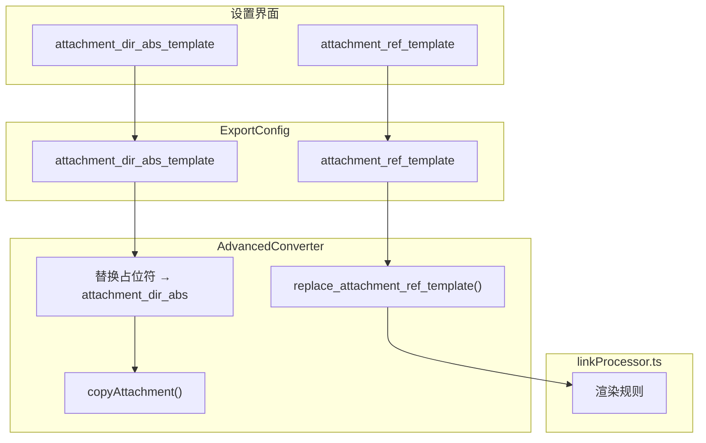

# 自定义附件路径方案

## 1. 变量命名约定

**统一使用 snake_case（下划线命名法）**，通过后缀标识类型：

| 后缀              | 含义            | 示例                            |
| --------------- | ------------- | ----------------------------- |
| `_abs`          | 绝对路径（运行时计算）   | `output_dir_abs`              |
| `_abs_template` | 模板，替换后生成绝对路径  | `attachment_dir_abs_template` |
| `_rel`          | 相对路径          | `style_dir_rel`               |
| `_rel_vault`    | 相对于 vault 的路径 | `source_path_rel_vault`       |
| `_template`     | 支持占位符的模板      | `output_dir_template`         |
| `_name`         | 文件名（不含路径）     | `export_file_name`            |

---

## 2. 变量重命名清单

### ExportConfig 接口字段（types.ts）

| 原名                 | 新名                     | 说明            |
| ------------------ | ---------------------- | ------------- |
| `output_dir`       | `output_dir_template`  | 输出目录路径模板      |
| `output_base_name` | `output_name_template` | 输出文件名模板       |
| `style_dir`        | `style_dir_rel`        | 样式目录（相对于插件目录） |

### textConverter.ts

| 原名                   | 新名                      | 说明                                    |
| -------------------- | ----------------------- | ------------------------------------- |
| `attachmentDir`      | **删除**                  | 不再需要，改用 `attachment_dir_abs_template` |
| `exportTargetDirAbs` | `export_target_dir_abs` | copyAttachment() 参数                   |
| `attachmentDirAbs`   | `attachment_dir_abs`    | copyAttachment() 局部变量（由模板生成）          |

### exportFormatsManager.ts

| 原名            | 新名               | 说明                   |
| ------------- | ---------------- | -------------------- |
| `outputDir`   | `output_dir_abs` | executeExport() 局部变量 |
| `styleDirAbs` | `style_dir_abs`  | executeExport() 局部变量 |

### linkParser.ts - LinkConfig 接口

| 原名            | 新名                      | 说明    |
| ------------- | ----------------------- | ----- |
| `source_path` | `source_path_rel_vault` | 源文件路径 |
| `export_name` | `export_file_name`      | 导出文件名 |

---

## 3. 新增配置字段

在 `ExportConfig` 接口中新增两个可选字段：

### `attachment_dir_abs_template`

- **用途**：附件复制目标目录模板（替换占位符后生成绝对路径）
- **类型**：支持占位符的字符串
- **默认值**：`{{outputDir}}/assets`
- **示例**：
  - `{{outputDir}}/assets` → `/Users/me/vault/output/assets`
  - `/tmp/images/{{noteName}}` → `/tmp/images/my-note`

### `attachment_ref_template`

- **用途**：附件引用完整模板（包含 `` 或 `#image("...")` 语法）
- **类型**：支持占位符的字符串
- **必需占位符**：`{{attachmentName}}` - 当前处理的附件文件名（必须包含）
- **默认值**：
  - Typst：`#image("assets/{{attachmentName}}", width: 100%)`
  - HMD/Quarto：``
- **示例**：
  - `#image("images/{{attachmentName}}", width: 80%)` → `#image("images/img.png", width: 80%)`
  - `` → ``

---

## 4. 支持的占位符

| 占位符                  | 描述                 | 适用范围                        |
| -------------------- | ------------------ | --------------------------- |
| `{{outputDir}}`      | 输出目录绝对路径           | attachment_dir_abs_template |
| `{{attachmentName}}` | **当前处理的附件文件名（必需）** | attachment_ref_template     |
| `{{noteName}}`       | 当前笔记名称             | 通用                          |
| `{{vaultDir}}`       | vault 根目录绝对路径      | 通用                          |
| `{{noteDir}}`        | 笔记所在目录绝对路径         | 通用                          |
| `{{date:FORMAT}}`    | 日期格式化              | 通用                          |

---

## 5. 修改思路

### 5.1 types.ts

- 重命名 ExportConfig 中的三个字段
- 新增两个可选字段：`attachment_dir_abs_template` 和 `attachment_ref_template`
- 在 EXPORT_CONFIGS_CONSTANTS 中添加对应的默认值常量
- 更新 `isExportConfig` 类型守卫

### 5.2 textConverter.ts

- **删除** BaseConverter 的 `attachmentDir` 属性（不再需要）
- 重命名 copyAttachment() 方法的参数和局部变量
- 修改 copyAttachment() 逻辑：从 `attachment_dir_abs_template` 生成 `attachment_dir_abs`
- 在 AdvancedConverter 中添加 `replace_attachment_ref_template()` 方法：
  - 读取配置中的 `attachment_ref_template`，若无则使用格式对应的默认值
  - 替换模板中的占位符
  - 返回完整的引用语句

### 5.3 linkProcessor.ts

- 重命名局部变量 `export_name` 为 `export_file_name`
- 修改 Typst 和 HMD 的渲染规则：
  - 若 converter 是 AdvancedConverter，调用 `replace_attachment_ref_template()` 生成完整引用
  - 否则使用原有的默认逻辑

### 5.4 exportFormatsManager.ts

- 重命名局部变量
- 同步更新对 ExportConfig 字段的引用

### 5.5 ExportFormatsSettings.vue

- 同步更新现有字段绑定（字段重命名）
- 新增两个输入框：附件目录模板、附件引用模板
- 添加对应的占位符提示和预览功能

---

## 6. 数据流

---

## 7. TODO 清单

### Step 1: 变量重命名

- types.ts: 重命名 `output_dir` → `output_dir_template`
- types.ts: 重命名 `output_base_name` → `output_basename_template`
- types.ts: 重命名 `style_dir` → `style_dir_rel`
- textConverter.ts: 重命名 `exportTargetDirAbs` → `output_dir_abs`
- textConverter.ts: 重命名 `attachmentDirAbs` → `attachment_dir_abs`
- exportFormatsManager.ts: 重命名 `outputDir` → `output_dir_abs`
- exportFormatsManager.ts: 重命名 `styleDirAbs` → `style_dir_abs`
- linkParser.ts: 重命名 `source_path` → `**source_path_rel_vault**`
- linkParser.ts: 重命名 `export_name` → `export_file_name`
- 全局搜索替换，确保所有引用同步更新

### Step 2: 类型定义更新 (types.ts)

- ExportConfig 接口添加 `attachment_dir_abs_template?: string`
- ExportConfig 接口添加 `attachment_ref_template?: string`
- EXPORT_CONFIGS_CONSTANTS 添加 `DEFAULT_ATTACHMENT_DIR_ABS_TEMPLATE`
- EXPORT_CONFIGS_CONSTANTS 添加 `DEFAULT_ATTACHMENT_REF_TEMPLATE_TYPST`
- EXPORT_CONFIGS_CONSTANTS 添加 `DEFAULT_ATTACHMENT_REF_TEMPLATE_HMD`
- 更新 `isExportConfig` 类型守卫

### Step 3: 转换器更新 (textConverter.ts)

- textConverter.ts: **删除** `attachmentDir` 属性
- 修改 copyAttachment()：从 `attachment_dir_abs_template` 生成 `attachment_dir_abs`
- AdvancedConverter 添加 `replace_attachment_ref_template(file_name: string)` 方法
- 方法中替换 `{{attachmentName}}` 为传入的附件文件名参数（必需占位符）
- 根据 format 类型选择对应的默认模板

### Step 4: 渲染规则更新 (linkProcessor.ts)

- Typst 渲染规则：调用 `replace_attachment_ref_template()` 生成完整引用
- HMD/Quarto 渲染规则：调用 `replace_attachment_ref_template()` 生成完整引用
- 保留 BaseConverter 的回退逻辑

### Step 5: 设置界面更新 (ExportFormatsSettings.vue)

- 同步更新字段绑定（字段重命名）
- 添加 `attachment_dir_abs_template` 输入框
- 添加 `attachment_ref_template` 输入框
- 添加占位符提示组件
- 添加预览功能

